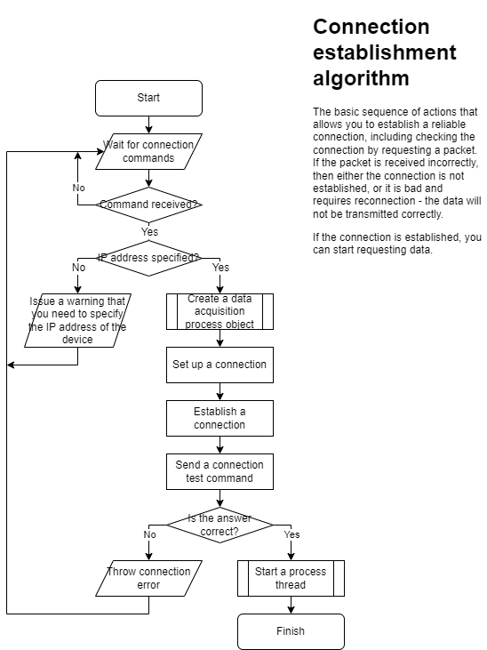

<!--
# ScanPort

The program is a solution to the task from the fourth laboratory on the subject "Network Information Technologies".

## Overview

This program is a keylogger. Its main functionality:

- Ability to hide in tray;
- Registers keyboard keystrokes;
- Registers mouse clicks and releases (it is possible to turn on the display of coordinates);
- Registers mouse scrolling with coordinates;
- Registers mouse movements with coordinates;
- Ability to save a log file;
- All reference information and documentation are described in script files;
- And many other important things.
-->





## ATTEMPTION!!!

1. For the program to work, you need to install Nmap!!! We recommend [the official source of the developer](https://nmap.org/download.html). ТAlso install the library in Python: ```pip install python-nmap```.
2. After installing the program, add Nmap to your system PATH variables. Now WiretappingScanner will scan all devices on the local network with a static(!) IP address.
3. To make the device visible on the network: connect it to your Wi-Fi and set the device's IP address to static in the local network settings. Now Nmap will be able to detect your device on the local network, and you can connect it to the program.

## LICENSE

The full text of the license can be found at the following [link](https://github.com/Nakama3942/WiretappingScanner/blob/master/LICENSE).

> Copyright © 2023 Kalynovsky Valentin. All rights reserved.
>
> Licensed under the Apache License, Version 2.0 (the "License");
> you may not use this file except in compliance with the License.
> You may obtain a copy of the License at
>
> http://www.apache.org/licenses/LICENSE-2.0
>
> Unless required by applicable law or agreed to in writing, software
> distributed under the License is distributed on an "AS IS" BASIS,
> WITHOUT WARRANTIES OR CONDITIONS OF ANY KIND, either express or implied.
> See the License for the specific language governing permissions and
> limitations under the License.

<!--
## Usage

### With Python

To start the program, just run *main.pyw*.

But it is also possible to run the program through the console:

```shell
python main.pyw
```

If the program gives a missing modules' error at startup, install *Qt* and *pynput*:

```shell
pip install pyqt6
pip install pynput
```

If you finalize the interface, you will need an interface converter from the library *pyqt-tools*:

```shell
pip install pyqt-tools
```

### Without Python

There is a compiled version of the program. To use it, simply download the archive in the binaries' section under the latest version release. Unzip the archive and then use it as a regular program.
-->

## Authors

<table align="center" style="border-width: 10; border-style: ridge">
	<tr>
 		<td align="center"><a href="https://github.com/Nakama3942"><br /><sub><b>Kalynovsky Valentin</b></sub></a><sub><br />"Ideological inspirer and Author"</sub></td>
	    <!--<td></td>-->
 	</tr>
<!--
 	<tr>
 		<td></td>
 		<td></td>
 	</tr>
-->
</table>
