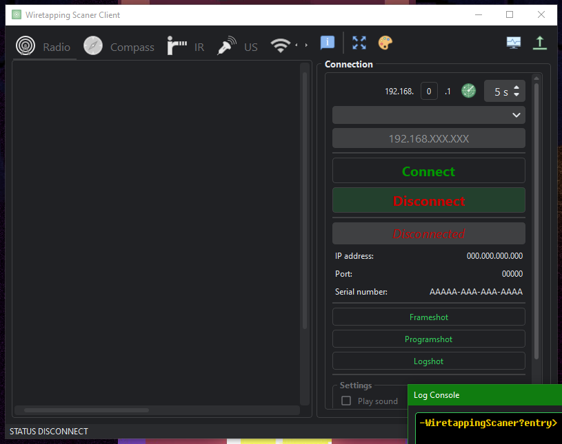
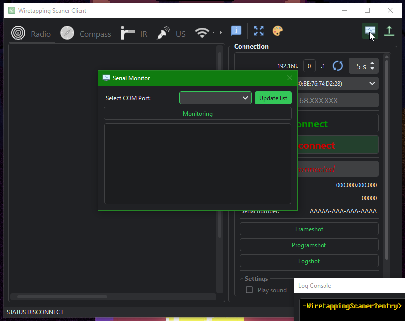
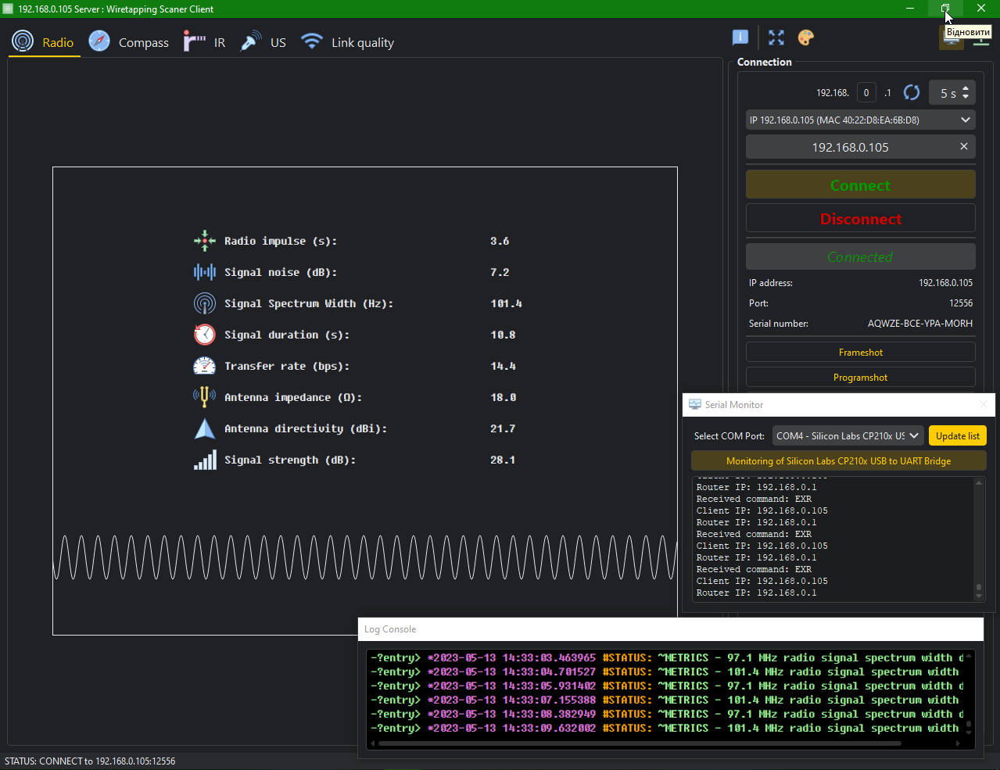
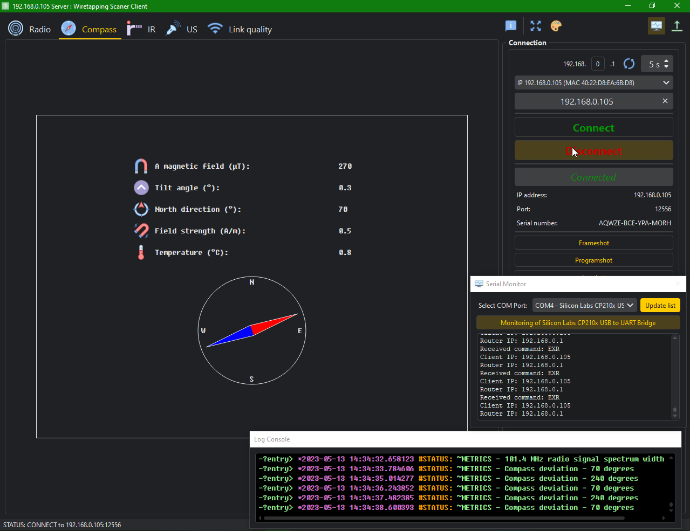

<div align="center">

[](https://github.com/Nakama3942/WiretappingScanner/blob/master/LICENSE)

</div>

# Wiretapping Scanner Client
### Content
- [Wiretapping Scanner Client](#wiretapping-scanner-client)
	- [Content](#content)
	- [Overview](#overview)
	- [LICENSE](#license)
	- [Installation](#installation)
    - [Screenshots](#screenshots)
	- [Authors](#authors)

## Overview
Client program for drawing received data from the Wiretapping Scanner device.

## LICENSE
The full text of the license can be found at the following [link](https://github.com/Nakama3942/WiretappingScanner/blob/master/LICENSE).

> Copyright © 2023 Kalynovsky Valentin. All rights reserved.
>
> Licensed under the Apache License, Version 2.0 (the "License");
> you may not use this file except in compliance with the License.
> You may obtain a copy of the License at
>
> http://www.apache.org/licenses/LICENSE-2.0
>
> Unless required by applicable law or agreed to in writing, software
> distributed under the License is distributed on an "AS IS" BASIS,
> WITHOUT WARRANTIES OR CONDITIONS OF ANY KIND, either express or implied.
> See the License for the specific language governing permissions and
> limitations under the License.

## Installation
Before using the program, it is necessary to comply with certain conditions:
- [ ] Most importantly, you need to install, of course, [the graphical framework](https://pypi.org/project/PyQt6/): ```pip install pyqt6```;
- [ ] To display a beautiful modern interface, [the theme-library PyQtDarkTheme](https://github.com/5yutan5/PyQtDarkTheme) was used: ```pip install pyqtdarktheme```;
- [ ] If you modify the program, then the [pyqt-tools](https://pypi.org/project/pyqt-tools/) utility is used to convert the Qt .ui file: ```pip install pyqt-tools```;
- [ ] Even if Nmap is not installed on the system and will not be used, it is necessary to install the ```pip install python-nmap``` [library](https://pypi.org/project/python-nmap/).
	- [ ] However, if you want to use Nmap, we recommend [the official source of the developer](https://nmap.org/download.html).
	- [ ] After installing the program, add Nmap to your system PATH variables. Now WiretappingScanner will scan all devices on the local network with a static(!) IP address.
	- [ ] To make the device visible on the network: connect it to your Wi-Fi and set the device's IP address to static in the local network settings. Now Nmap will be able to detect your device on the local network, and you can connect it to the program.
- [ ] For the logger to work, of course, you need to install the logging library. For these purposes, I developed and wrote my [own logging library](https://pypi.org/project/mighty-logger/). You can install it with the following command: ```pip install mighty-logger==0.5.1```. You need to install this particular version, since the library will continue to develop, and the software will soon finish its development and there may be problems using the library.
- [ ] The author actively uses the Markdown format, and some windows in the program are designed using this markup syntax. And to support it, you need to install the [markdown_it](https://pypi.org/project/markdown-it-py/) library: ```pip install markdown-it-py```.

After that, you can safely use the program. However, if you don't want to bother with preparation and setup - just download the compiled program from the archive in the release. You can also find the assembly diagram of the device and its firmware there.

## Screenshots
### Started program window
<div align="center"></div>

### Can separated log console
<div align="center"></div>

### Search of the static IP addresses
<div align="center"></div>

### Can opening the dialog window of listening a COM port (if device connected yet on USB)
<div align="center"></div>

### Connecting to device and receiving of data
<div align="center"></div>

### Can changing appearance, accent color and services font
<div align="center"></div>

### Can expanding program window to whole screen
<div align="center"></div>

### Can open program window in full-screen mode
<div align="center"></div>

### Jumping on tabs and start disconnection
<div align="center"></div>

### Disconnected from devise
<div align="center"></div>

### Seeing saved log
<div align="center"></div>

## Authors

<table align="center" style="border-width: 10; border-style: ridge">
	<tr>
		<td align="center" width="200"><a href="https://github.com/Nakama3942"><br /><sub><b>Kalynovsky Valentin</b></sub></a><sub><br />"Ideological inspirer and Author", developer of software and connector</sub></td>
		<!--<td></td>-->
	</tr>
<!--
	<tr>
		<td></td>
		<td></td>
	</tr>
-->
</table>
